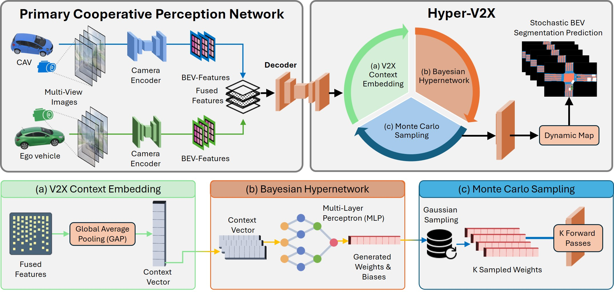

<div align="center">

# Hyper-V2X: Hypernetworks for Estimating Epistemic and Aleatoric Uncertainty in Cooperative Bird's-Eye-View Semantic Segmentation
  <h3 align="center">IEEE IV 2026 Oral</h3>
  <p align="center">
    <a href="">Abhishek Dinkar Jagtap</a>
    &nbsp;·&nbsp;
    <a href="">Sanath Tiptur Sadashivaiah</a>
    &nbsp;·&nbsp;
    <a href="">Andreas Festag</a>
    &nbsp;·&nbsp;

[](https://abhishekjagtap1.github.io/HyperV2X/)&nbsp;&nbsp;
[](https://arxiv.org/abs/2605.21309v1)&nbsp;&nbsp;
[](https://huggingface.co/Uchihadj/Hyper-V2X)

<p align="center">
    
</p>


Hyper-V2X conditions a Bayesian hypernetwork on fused multi-agent BEV features to generate stochastic decoder weights, enabling calibrated epistemic and aleatoric uncertainty estimation in cooperative Bird's-Eye-View semantic segmentation.

</div>


# News 🚀
- [x] Accepted to IEEE IV 2026 as Oral Presentation 
- [x] Release weights and evaluation code
- [x] Release main training code 
- [ ] Release visualization scripts to merge uncertainty maps
  

## Pipeline Overview



  

## Installation

<details> <summary>Clone this repository</summary>

```bash
git clone https://github.com/abhishekjagtap1/Hyper-V2X
```
</details>
<details> <summary>Set up the conda environment</summary>

```
cd Hyper-V2X/opv2v

# Setup conda environment
conda create -y --name hyperv2x python= 3.8

conda activate hyperv2x
pip install torch==2.4.0 torchvision==0.19.0 torchaudio==2.4.0 --index-url https://download.pytorch.org/whl/cu118

# Install dependencies

python opencood/utils/setup.py build_ext --inplace
python setup.py develop
pip install -r requirements.txt

```
</details>

## Acquiring Datasets
Our Hyper-V2X uses the same training datasets as CoBeVT. Below we quote OpenCOOD's [detailed instructions](https://github.com/DerrickXuNu/CoBEVT/tree/main/opv2v#:~:text=on%20OpenCOOD(ICRA2022)-,Data%20Preparation,-Download%20OPV2V%20origin) on getting datasets.
> 1. Download OPV2V origin data and structure it as required. See [OpenCOOD data tutorial](https://opencood.readthedocs.io/en/latest/md_files/data_intro.html) for more detailed insructions.
> 2. After organize the data folders, download the `additional.zip` from [this url](https://ucla.app.box.com/v/UCLA-MobilityLab-OPV2V/file/1621920078208). This file contains BEV semantic segmentation labels that origin OPV2V data does not include.
> 3. The `additional` folder has the same structure of original OPV2V dataset. So unzip `additional.zip` and merge them with original opv2v data.
> 4. Remove scenario `opv2v/train/2021_09_09_13_20_58`, as this scenario has some bug for camera data.

## <div align="center">**Visualization**</div>
To quickly visualize a single sample of the data:
```shell
cd CoBEVT/opv2v
python opencood/visualization/visialize_camera.py [--scene ${SCENE_NUMBER} --sample ${SAMPLE_NUMBER}]
```
* `scene`: The ith scene in the data. Default: 4
* `sample`: The jth sample in the ith scene. Default: 10


## <div align="center">**Inference**</div>
To run the pre-trained model with different compression rates, first download the `hyperv2x` pretrained weights from [Hugging Face](https://huggingface.co/Uchihadj/Hyper-V2X/tree/main/compression_exp). Then place the downloaded files under `opv2v/logs/`.

Please run the following command for stochaistic BEV map segmentation and uncertainty estimation
```python
python opencood/tools/inference_all_uncertainity_nll.py --model_dir opencood/logs/hyperv2x/compression_64 --save_vis
```

Arguments Explanation:
- `save_vis`: Bool to save **Predictions**, **Epistemic** and **Aleatoric** uncertainty maps.
- `model_dir` : the path of the checkpoints. we provide checkpoints for multiple `compression_rates` [this url](https://huggingface.co/Uchihadj/Hyper-V2X/tree/main/compression_exp) with their corresponding  `config.yaml` file.

To merge the results from **Epistemic** and **Aleatoric** uncertainty maps, **dynamic segmentation** and **GT staic maps** please run the following command (please run the below two commands)
```python
TODO:
```

Note: When you want to run on test set, make sure change `validation_dir` in the yaml file to the testing folder.


## <div align="center">**OpenCOOD General Training Commands**</div>
OpenCOOD uses yaml file to configure all the parameters for training. To train your own model
from scratch or a continued checkpoint **on a single gpu**, run the following commonds:
```python
python opencood/tools/train_camera.py --hypes_yaml ${CONFIG_FILE} [--model_dir  ${CHECKPOINT_FOLDER}]
```
Arguments Explanation:
- `hypes_yaml`: the path of the training configuration file, e.g. `opencood/hypes_yaml/opcamera/cobevt.yaml`.
- `model_dir` (optional) : the path of the checkpoints. This is used to fine-tune the trained models. When the `model_dir` is
given, the trainer will discard the `hypes_yaml` and load the `config.yaml` in the checkpoint folder.
  
To train on **multiple gpus**, run the following command:
```
CUDA_VISIBLE_DEVICES=0,1,2,3 python -m torch.distributed.launch --nproc_per_node=4  --use_env opencood/tools/train_camera.py --hypes_yaml ${CONFIG_FILE} [--model_dir  ${CHECKPOINT_FOLDER}
```

## <div align="center">**Hyper-V2X Training Pipeline**</div>

### Stage 1: Train Single-Vehicle Baseline (SinBeVT)

Train the single-vehicle model for 90 epochs:
```python
python opencood/tools/train_camera.py --hypes_yaml opencood/hypes_yaml/opcamera/fax.yaml
``` 
This produces the SinBeVT pretrained backbone, which is used as initialization for Hyper-V2X.

### Stage 2: Prepare Hyper-V2X Initialization
After training SinBeVT:
```shell
mkdir -p logs/HyperV2X
``` 
Copy the SinBeVT checkpoint into the folder:
```shell
cp ${SINBEVT_CHECKPOINT} logs/HyperV2X/net_epoch_1.pth
cp ${CONFIG_FILE} logs/HyperV2X/corbevt.yaml
``` 

### Stage 3: Train Hyper-V2X
Start Hyper-V2X training from pretrained initialization:
```python
python opencood/tools/train_camera.py \
    --hypes_yaml ${CONFIG_FILE} \
    --model_dir logs/HyperV2X
``` 
### Stage 4: Fine-Tuning with Compression Rates
Fine-tune Hyper-V2X under different communication compression rates: we provide a set of `hypes_yaml` files for various compression rates at `opv2v/opencood/hypes_yaml/compression_rates` 

```python
python opencood/tools/train_camera.py \
  --hypes_yaml opv2v/opencood/hypes_yaml/compression_rates/compression_64.yaml \
  --model_dir  logs/HyperV2X
```

## <div align="center">**Uncertainty Estimation under Communication Constraints**</div>


As the compression rate (CPR) increases from 0 to 64, we observe progressive degradation in segmentation performance. Specific objects that are accurately detected at compression rate 0 gradually deteriorate as communication bandwidth is reduced, until they are no longer detected at compression rate 64. Critically, our uncertainty maps effectively capture this degradation and exhibit progressively higher epistemic and aleatoric uncertainty as compression increases.

## Acknowledgement 

Some source code of ours is borrowed from [CoBevt](https://github.com/DerrickXuNu/CoBEVT) and [Torch Uncertainty](https://github.com/torch-uncertainty/torch-uncertainty) and [HyperDM](https://github.com/matthewachan/hyperdm). We sincerely appreciate the excellent works of these authors.


## BibTeX 
If you find this repository useful, please consider giving a star ⭐ and citation 🦖:
```
@inproceedings{jagtap2025hyperv2x,
  author    = {Jagtap, Abhishek Dinkar and Tiptur Sadashivaiah, Sanath and Festag, Andreas},
  title     = {Hyper-V2X: Hypernetworks for Estimating Epistemic and Aleatoric Uncertainty
               in Cooperative Bird's-Eye-View Semantic Segmentation},
  booktitle = {IEEE Intelligent Vehicles Symposium (IV)},
  year      = {2026},
  note      = {Oral presentation},
  url       = {https://arxiv.org/abs/2605.21309v1}
}

TODO:

```


